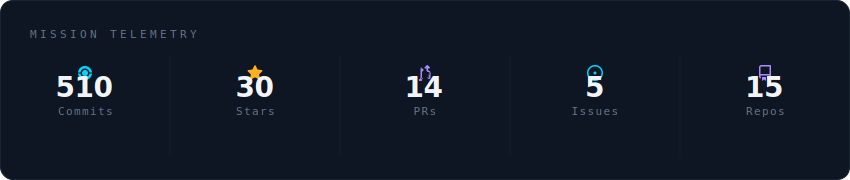

# galaxy-profile


A dynamic GitHub profile README generator that creates animated SVG banners with a space/galaxy theme. Your GitHub stats, tech stack, and featured projects are rendered as a living galaxy.

## Preview

<div align="center">
  
</div>

<br/>

<div align="center">
  
</div>

<br/>

<div align="center">
  
</div>

<br/>

<div align="center">
  
</div>

## Features

- **Spiral Galaxy Header** — animated galaxy with spiral arms, shooting stars, and a glowing core displaying your name and tagline
- **Mission Telemetry** — real-time GitHub stats (commits, stars, PRs, issues, repos) fetched via GraphQL or REST fallback
- **Language Telemetry + Focus Sectors** — language usage bars and a rotating radar chart of your focus areas
- **Featured Systems** — project cards with orbital animations and constellation connections
- **Fully Configurable** — colors, focus areas, projects, and displayed metrics are all controlled via `config.yml`
- **Auto-Updates** — GitHub Actions regenerates SVGs every 12 hours or on config changes

## Quick Start

1. **Fork this repo** (or use "Use this template") and rename it to your GitHub username.
2. Copy the example config:
   ```bash
   cp config.example.yml config.yml
   ```
3. Edit `config.yml` with your details (username, name, tagline, tech stack, projects, etc.)
4. Replace `README.md` with the contents of [`README.profile.md`](README.profile.md) and customize the social links.
5. Push — the GitHub Action will generate and commit the SVGs automatically.

> **Important:** This repo ships with `--demo` mode enabled in the GitHub Action so it works out-of-the-box with sample data. After creating your `config.yml` in step 3, edit `.github/workflows/generate-profile.yml` and change the generate step from:
> ```yaml
> run: python -m generator.main --demo
> ```
> to:
> ```yaml
> run: python -m generator.main
> ```
> This switches from demo data to your real GitHub stats.

> **Note:** The first run may need a manual trigger. Go to Actions > "Generate Profile SVGs" > "Run workflow".

## Configuration Reference

All configuration lives in `config.yml`. See [`config.example.yml`](config.example.yml) for a fully commented template.

| Section | Description |
|---------|-------------|
| `username` | Your GitHub username (required) |
| `profile` | Name, tagline, company, location, bio, philosophy |
| `social` | Email, LinkedIn handle, website URL |
| `galaxy_arms` | 3 focus areas — each with a name, color (`synapse_cyan`, `dendrite_violet`, `axon_amber`), and tech items |
| `projects` | Featured repos — each with `repo`, `arm` index (0-2), and `description` |
| `theme` | 9 hex color overrides for the deep space palette |
| `stats.metrics` | Which metrics to show: `commits`, `stars`, `prs`, `issues`, `repos` |
| `languages` | Languages to `exclude` and `max_display` count |

## Local Development

### Setup

```bash
# Clone the repository
git clone https://github.com/YOUR_USERNAME/galaxy-profile.git
cd galaxy-profile

# Create and activate a virtual environment
python3 -m venv .venv
source .venv/bin/activate

# Install dependencies
pip install -r requirements.txt

# Copy the example config and customize it
cp config.example.yml config.yml
```

### Generating SVGs

**Demo mode** — no API calls, uses sample data from `config.example.yml`:

```bash
python -m generator.main --demo
```

**Without a token** — fetches public data only (commit data will be limited):

```bash
python -m generator.main
```

**With a token** — complete data including private contributions:

```bash
GITHUB_TOKEN=ghp_your_token_here python -m generator.main
```

To generate a token: [github.com/settings/tokens](https://github.com/settings/tokens) > Generate new token (classic) > select the `read:user` scope.

The 4 SVGs are written to `assets/generated/`.

### Viewing SVGs

Open any SVG directly in a browser:

```bash
open assets/generated/galaxy-header.svg
```

Or start a local server to view them all at once:

```bash
python3 -m http.server 8080
# Visit http://localhost:8080 and navigate to assets/generated/
```

### Running Tests

```bash
pip install -r requirements-dev.txt
pytest -v
```

Tests cover config validation, utility functions, and SVG generation. No network access or tokens required.

## How the GitHub Action Works

The workflow (`.github/workflows/generate-profile.yml`) runs automatically:

- **Every 12 hours** (cron schedule)
- **On push** when `config.yml` or `generator/**` files change
- **Manually** via the Actions tab (workflow_dispatch)

It generates the SVGs and commits them with the message `chore: update profile SVGs [skip ci]`.

## Troubleshooting

- **"Could not fetch stats"** — Invalid or expired token. Check the token or run without one to use the REST fallback.
- **SVG with XML error in browser** — Verify that `config.yml` is well-formatted YAML. Special characters (`&`, `<`, `>`) in text fields are escaped automatically, but malformed YAML will break generation.
- **Languages not showing** — Private repos don't return languages via REST without a token. Use a token with `repo` scope to include them.

## Contributing

Contributions are welcome! Here's how to help:

1. **Bug reports** — open an issue with steps to reproduce and expected vs actual behavior.
2. **Feature suggestions** — open an issue tagged **enhancement** describing the feature and why it's useful.
3. **Pull requests:**
   - Fork the repo and create a branch from `main`
   - Follow the [Local Development](#local-development) setup above
   - Make your changes and verify SVGs generate correctly (`python -m generator.main`)
   - Test your SVGs in a browser to verify animations render
   - Open a PR against `main` with a clear description

**Code guidelines:** SVG templates live in `generator/templates/` (one file per section). Config schema lives in `generator/config.py`. Don't commit `config.yml` (it's gitignored) — update `config.example.yml` for new config options. Keep PRs focused: one feature or fix per PR.

## Architecture

```
generator/
├── main.py              # Entry point — loads config, fetches data, writes SVGs
├── config.py            # Config validation and defaults
├── github_api.py        # GitHub GraphQL + REST client
├── svg_builder.py       # Orchestrator connecting config, stats, and templates
├── utils.py             # Colors, math helpers, SVG utilities
└── templates/
    ├── galaxy_header.py           # Spiral galaxy banner (850x280)
    ├── stats_card.py              # Metrics card (850x180)
    ├── tech_stack.py              # Language bars + radar chart (850xN)
    └── projects_constellation.py  # Project cards (850x220)
```
